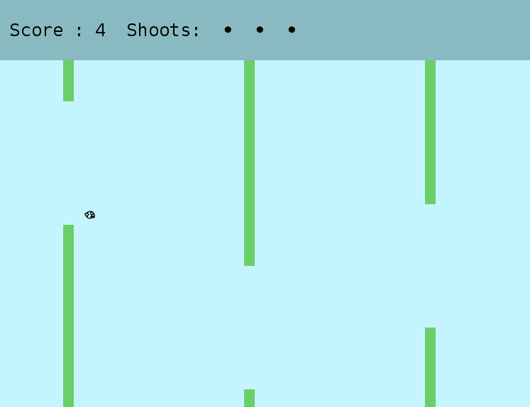
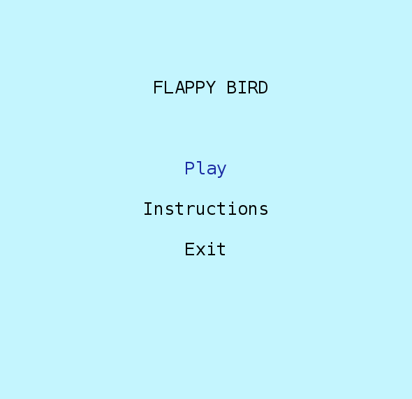
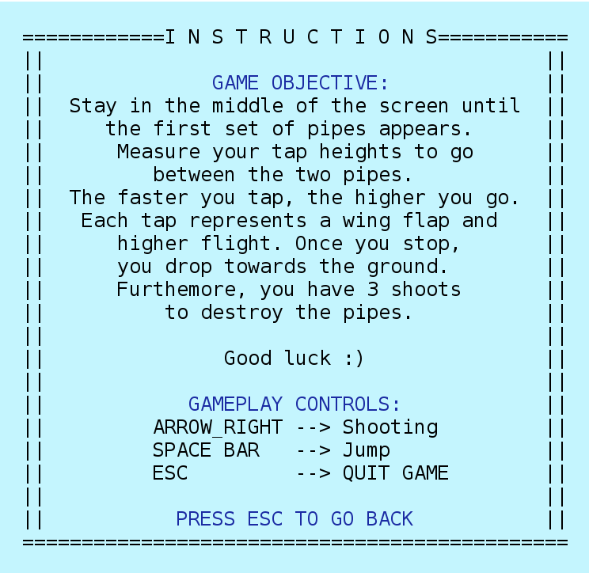
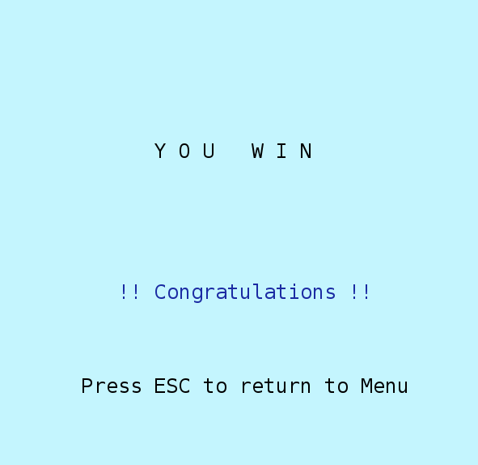
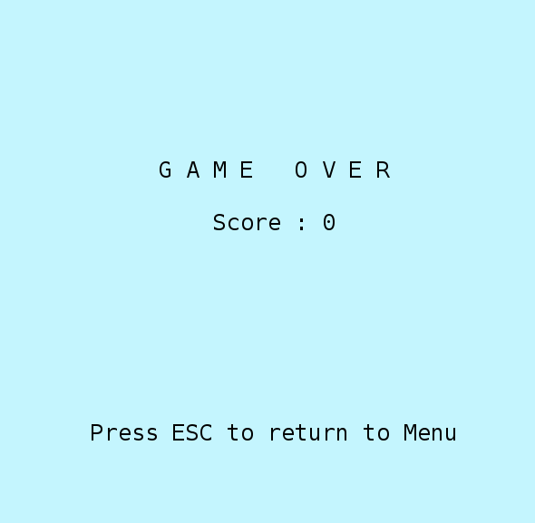

# FLAPPY BIRD

## Game Description

**Flappy Bird** is an arcade-style game in which the player controls the bird, which persistently falls down. The player is tasked with navigating bird through pairs of pipes that have equally sized gaps placed at random heights. The bird automatically descends and only ascends when the player taps the space key. Each successful pass through a pair of pipes awards the player a point according to the correspondent level. Colliding with a pipe or the ground ends the gameplay. The player wins the game if the bird passes through 150 pipes, corresponding to 5 levels.

This project was developed by Basílio Dias and Marina Santos.

For a more detailed version of this description click [here](./docs/README.md).

## FEATURES
- [x] Menu - When the game is initialized a Menu is displayed (the player chooses between playing, seeing instructions or quit)
- [x] Movement - The bird is able to jump when the space key is pressed.
- [x] Shooting - The bird can shoot laser beams that destroys pipes.
- [x] Pipes - The pipes appear randomly throughout the map and move in a single direction.
- [x] Bird Collisions - If the bird collides with an pipe or with the borders of the map, he dies.
- [x] Score - When the bird passes between pipes, he gains points.
- [x] Game Over - When the bird collide the game ends.
- [x] Win game - When the bird wins the game.
- [x] Instructions - A page that shows the basic controls for the game.
- [x] SoundTrack - Play background music when user is playing
- [x] Sounds - Play sounds when the bird jump, or he fires a laser beam, or when there is a collision.
 
## Screenshots 
The following screenshots ilustrate the general look of our game, as well as the functionalities: 

### Game Preview

### Menus
**Initial Menu**

**Instructions**

### End Game
**Win Game**

**Game Over**

