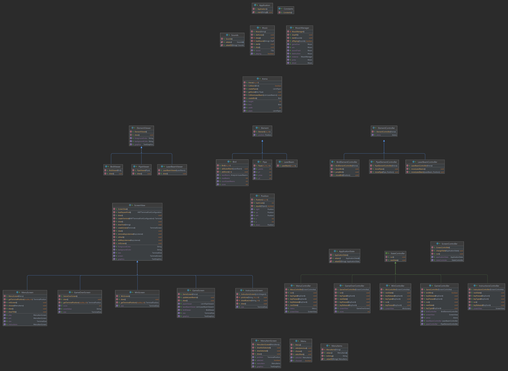
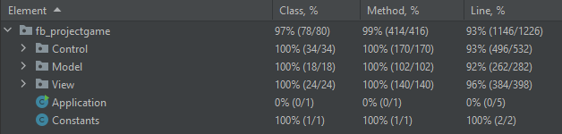
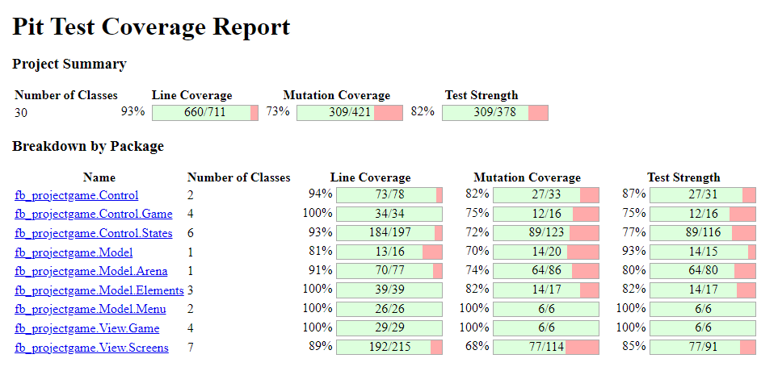

# FLAPPY BIRD

**Flappy Bird** is an arcade-style game in which the player controls the bird, which persistently falls down. The player is tasked with navigating bird through pairs of pipes that have equally sized gaps placed at random heights. The bird automatically descends and only ascends when the player taps the space key. Each successful pass through a pair of pipes awards the player a point according to the correspondent level. Colliding with a pipe or the ground ends the gameplay. The player wins the game if the bird passes through 150 pipes, corresponding to 5 levels.

This project was developed by Basílio Dias and Marina Santos.

## FEATURES
- [x] Menu - When the game is initialized a Menu is displayed (the player chooses between playing, seeing instructions or quit)
- [x] Movement - The bird is able to jump when the space key is pressed.
- [x] Shooting - The bird can shoot laser beams that destroys pipes.
- [x] Pipes - The pipes appear randomly throughout the map and move in a single direction.
- [x] Bird Collisions - If the bird collides with an pipe or with the borders of the map, he dies.
- [x] Score - When the bird passes between pipes, he gains points.
- [x] Game Over - When the bird collide the game ends.
- [x] Win game - When the bird wins the game.
- [x] Instructions - A page that shows the basic controls for the game.
- [x] SoundTrack - Play background music when user is playing
- [x] Sounds - Play sounds when the bird jump, or he fires a laser beam, or when there is a collision.

## IMPLEMENTATION - UML

## DESIGN PATTERNS

### FUNDAMENTAL ORGANIZATION OF THE CODE

**Problem in Context** 

When we were organizing the project, we realized that the code would get very messy and hard to read without an appropriate structure.

**The Pattern**

We have applied the **MVC** pattern. This pattern separates the game logic from the display code, allowing us to easily fix bugs and improve code readability.

The packages can be found in:

- [Controller](https://github.com/MarinaCostaSantos/FlappyBird/tree/main/src/main/java/fb_projectgame/Control)
- [Model](https://github.com/MarinaCostaSantos/FlappyBird/tree/main/src/main/java/fb_projectgame/Model)
- [View](https://github.com/MarinaCostaSantos/FlappyBird/tree/main/src/main/java/fb_projectgame/View)

**Consequences**

The use of the MVC Pattern in the current design has the following benefits:

- When we want to add a new feature to our game, the code will be more modular and organized. All we have to do is create another controller, model, or view, depending on the requirements of the new feature. Then it is easier to integrate it with the existing code.
- The code is both more readable and easier to write.
- Allows for a more adjustable code. For example, if we want to change the game's aesthetics, we can easily update its View.

However, applying MVC requires more thinking and organizing before-hand.

### INPUT MANAGEMENT

**Problem in Context**

We realized that we had to inform the objects of the application when an input was read, so it could act accordingly.

**The Pattern**

To solve this issue, we implemented the **Observer** pattern. This pattern lets you notify multiple objects about any events that happen to the object they’re observing.

The classes can be found in:

- [java.awt.Component](https://docs.oracle.com/javase/7/docs/api/java/awt/Component.html)
- [KeyListener](https://docs.oracle.com/javase/7/docs/api/java/awt/event/KeyListener.html)
- [GameController](https://github.com/MarinaCostaSantos/FlappyBird/blob/main/src/main/java/fb_projectgame/Control/States/GameController.java)
- [MenuController](https://github.com/MarinaCostaSantos/FlappyBird/blob/main/src/main/java/fb_projectgame/Control/States/MenuController.java)
- [InstructionsController](https://github.com/MarinaCostaSantos/FlappyBird/blob/main/src/main/java/fb_projectgame/Control/States/InstructionsController.java)
- [GameOverController](https://github.com/MarinaCostaSantos/FlappyBird/blob/main/src/main/java/fb_projectgame/Control/States/GameOverController.java)
- [WinController](https://github.com/MarinaCostaSantos/FlappyBird/blob/main/src/main/java/fb_projectgame/Control/States/WinController.java)

**Consequences**

Using the **Observer** Pattern allows to:
-   Introduce new subscriber classes without having to change the publisher’s code (and vice versa if there’s a publisher interface).
-   Establish relations between objects at runtime.

### CHANGING PROGRAM STATES

**Problem in Context**

Developing the menu, we came to the conclusion that there was a finite number of states which our application could be in, at any given moment. The program needed to be able to switch from one state to another instantaneously. However, depending on a current state, the program may or may not switch to certain other states.

**The Pattern**

The most obvious solution to our problem is implementing the **State** pattern. With this pattern, we can separate all the states in individual classes and implement their specific methods in these classes.

The classes can be found in:
- [ScreenController](https://github.com/MarinaCostaSantos/FlappyBird/blob/main/src/main/java/fb_projectgame/Control/States/ScreenController.java)
- [StateController](https://github.com/MarinaCostaSantos/FlappyBird/blob/main/src/main/java/fb_projectgame/Control/States/StateController.java)
- [GameController](https://github.com/MarinaCostaSantos/FlappyBird/blob/main/src/main/java/fb_projectgame/Control/States/GameController.java)
- [MenuController](https://github.com/MarinaCostaSantos/FlappyBird/blob/main/src/main/java/fb_projectgame/Control/States/MenuController.java)
- [InstructionsController](https://github.com/MarinaCostaSantos/FlappyBird/blob/main/src/main/java/fb_projectgame/Control/States/InstructionsController.java)
- [GameOverController](https://github.com/MarinaCostaSantos/FlappyBird/blob/main/src/main/java/fb_projectgame/Control/States/GameOverController.java)
- [WinController](https://github.com/MarinaCostaSantos/FlappyBird/blob/main/src/main/java/fb_projectgame/Control/States/WinController.java)

**Consequences**

Applying the **State** pattern allows to:

- Organize the code of the various states into individual classes
- Introduce new states in a much easier way, without having to change existing state classes or the context.

### USING THE SAME INSTANCE

**Problem in Context**

When adding sounds to our project, we noticed that several classes required access to a class that would manage the music. We wanted to ensure that the manager had only one instance.

**The Pattern**

To solve this issue, we implemented the **Singleton** pattern which allow us to instantiate a single object of a certain class, providing a global access point to this instance.

The classes can be found in:

- [MusicManager](https://github.com/MarinaCostaSantos/FlappyBird/blob/main/src/main/java/fb_projectgame/Control/MusicManager.java)
- [ScreenController](https://github.com/MarinaCostaSantos/FlappyBird/blob/main/src/main/java/fb_projectgame/Control/States/ScreenController.java)
- [GameController](https://github.com/MarinaCostaSantos/FlappyBird/blob/main/src/main/java/fb_projectgame/Control/States/GameController.java)
- [Arena](https://github.com/MarinaCostaSantos/FlappyBird/blob/main/src/main/java/fb_projectgame/Model/Arena/Arena.java)

**Consequences**

Applying the **Singleton** pattern:

- Each time we need to access the MusicManager class we can simply get an instance of the object, so there is no need to pass it as an attribute to all the classes that use it.
- We can be sure that a class has only a single instance.
- It is harder to unit test the code of the Singleton because many test frameworks rely on inheritance when producing mock objects (we had to use a new type of mock, the MockedStatic instead of the regular Mockito).

## BETTER CODE HUB

Result of the analysis: 8/10

**Failed guidelines:**

- Separate Concerns in Modules;
- Couple Architecture Components Loosely;

These guidelines were not accomplished because we used the **MVC** pattern. This pattern pressuposes the interconnection of three layers of code (Model, View and Controller), meaning it is impossible to keep the codebase loosely coupled.

## REFACTORINGS

### Refactoring: Applied MVC Pattern
- Changed packages and code structure to separate game logic from display.

### Refactoring: Create enum for ApplicationState, Sounds and MenuItems.
- Replaced code with constants.

### Refactoring: Using KeyListener instead of ProcessKey
- Substituted Algorithm to read inputs from the user.

### Refactoring: ScreenView
- Changed variable type from Screen to TerminalScreen.

### Refactoring: Final Entities
- Declared constants as final.

### Refactoring: ScreenView to BirdViewer, LaserBeamViewer and PipeViewer
- Removed fields/methods/lines of code from ScreenView to avoid large classes.

### Refactoring: View and ScreenView
- Extracted and moved methods setBackgroundColor and setForegroundColor

## CODE SMELLS

We didn't identify any code smells in our code.

## TEST COVERAGE

## MUTATION TESTING

We excluded the Application class from the pitest because it is not testable.

To consult the report, click [here](pitest/index.html).

